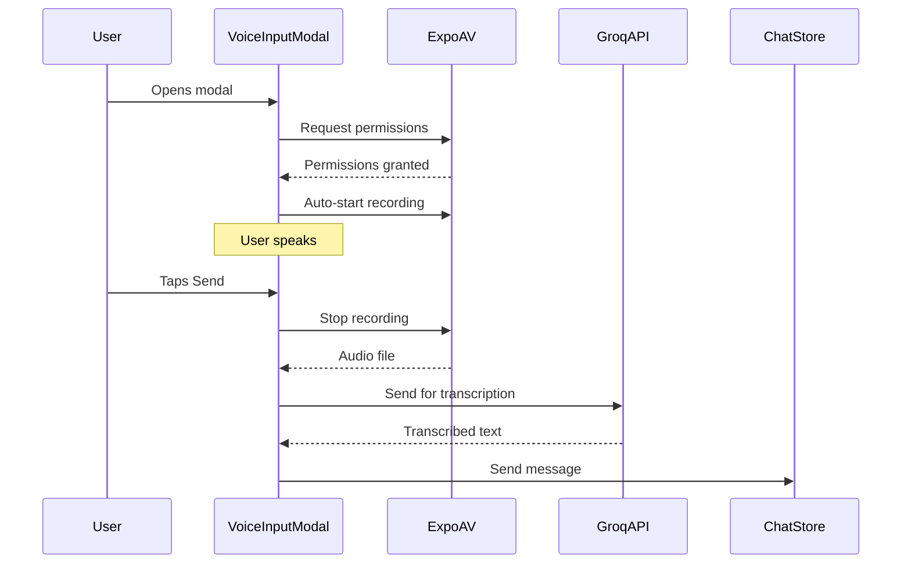

# Groq Voice Integration

This document describes the voice transcription integration with Groq's Whisper API in Onyx, including implementation details, usage guidelines, and best practices.

## Overview

The voice integration combines Expo's AV recording capabilities with Groq's Whisper-based transcription service to provide high-quality speech-to-text functionality. The implementation provides a seamless voice input experience with automatic recording and transcription.

## Architecture

### Components

1. **VoiceInputModal**
   - Handles audio recording UI/UX
   - Auto-starts recording when opened
   - Manages recording state and transcription
   - Integrates with ChatStore for message handling

2. **GroqChatApi**
   - Provides transcription service interface
   - Handles API communication
   - Manages error states and responses

3. **Expo AV**
   - Handles audio recording
   - Manages audio permissions
   - Provides audio file access

### Flow



## Implementation

### API Types

```typescript
// Transcription configuration
interface TranscriptionConfig {
  model: string
  language?: string
  prompt?: string
  response_format?: "json" | "text" | "verbose_json"
  temperature?: number
  timestamp_granularities?: ("word" | "segment")[]
}

// API Response
interface TranscriptionResponse {
  text: string
  x_groq: {
    id: string
  }
}
```

### Recording Setup

```typescript
// Initialize audio recording
const setupRecording = async () => {
  const { granted } = await Audio.requestPermissionsAsync()
  if (!granted) {
    setError("Microphone permission is required")
    return
  }

  await Audio.setAudioModeAsync({
    allowsRecordingIOS: true,
    playsInSilentModeIOS: true,
  })
  startRecording()
}

// Start recording
const startRecording = async () => {
  const { recording } = await Audio.Recording.createAsync(
    Audio.RecordingOptionsPresets.HIGH_QUALITY
  )
  return recording
}
```

### Transcription Process

```typescript
// In GroqChatApi
async transcribeAudio(
  audioUri: string,
  config: Partial<TranscriptionConfig> = {}
): Promise<{ kind: "ok"; response: TranscriptionResponse } | GeneralApiProblem> {
  const formData = new FormData()
  
  // Create file object from uri
  const fileInfo = {
    uri: audioUri,
    type: "audio/m4a",
    name: "recording.m4a"
  }
  
  formData.append("file", fileInfo as any)
  formData.append("model", config.model || "whisper-large-v3")
  if (config.language) formData.append("language", config.language)
  
  const response = await fetch(`${this.config.baseURL}/audio/transcriptions`, {
    method: "POST",
    headers: {
      Authorization: `Bearer ${this.config.apiKey}`,
      Accept: "application/json",
    },
    body: formData
  })
  
  // Handle response...
}
```

## Configuration

### Environment Variables

```bash
GROQ_API_KEY=your_api_key_here
```

### Default Configuration

```typescript
const DEFAULT_CONFIG: GroqConfig = {
  apiKey: Config.GROQ_API_KEY ?? "",
  baseURL: "https://api.groq.com/openai/v1",
  timeout: 30000,
}
```

### Audio Recording Options

```typescript
const RECORDING_OPTIONS = {
  ...Audio.RecordingOptionsPresets.HIGH_QUALITY,
  android: {
    extension: '.m4a',
    outputFormat: Audio.RECORDING_OPTION_ANDROID_OUTPUT_FORMAT_MPEG_4,
    audioEncoder: Audio.RECORDING_OPTION_ANDROID_AUDIO_ENCODER_AAC,
  },
  ios: {
    extension: '.m4a',
    outputFormat: Audio.RECORDING_OPTION_IOS_OUTPUT_FORMAT_MPEG4AAC,
    audioQuality: Audio.RECORDING_OPTION_IOS_AUDIO_QUALITY_MAX,
  },
}
```

## Usage

### Basic Implementation

```typescript
const VoiceInput = () => {
  const [isRecording, setIsRecording] = useState(false)
  const recording = useRef<Audio.Recording | null>(null)

  useEffect(() => {
    if (visible) {
      setupRecording()
    } else {
      stopRecording()
    }
  }, [visible])

  // ... rest of implementation
}
```

### Error Handling

The implementation includes comprehensive error handling at multiple levels:

1. **Recording Errors**
   - Permission denials
   - Hardware issues
   - File system errors

2. **Transcription Errors**
   - API communication failures
   - Invalid audio format
   - Transcription processing errors

3. **UI Error States**
   - Visual feedback for errors
   - Clear error messages

## Best Practices

1. **Audio Quality**
   - Use HIGH_QUALITY preset for best transcription results
   - Ensure good microphone access and positioning
   - Monitor audio levels for optimal input

2. **Error Handling**
   - Implement comprehensive error handling
   - Provide clear user feedback
   - Log errors appropriately

3. **User Experience**
   - Auto-start recording when modal opens
   - Show clear recording status
   - Provide visual feedback for all states
   - Allow preview before sending

4. **Performance**
   - Clean up resources after use
   - Handle background/foreground transitions
   - Manage memory usage for long recordings

## Limitations

1. **Audio Format Support**
   - Supported formats: m4a (recommended)
   - Maximum file size: 25MB
   - Optimal quality vs. size balance needed

2. **API Constraints**
   - Rate limiting considerations
   - Timeout handling for long files
   - Cost considerations for API usage

## Future Improvements

1. **Enhanced Features**
   - Real-time transcription streaming
   - Multiple language support
   - Speaker diarization
   - Noise reduction

2. **Performance Optimizations**
   - Audio compression
   - Caching mechanisms
   - Offline support

3. **User Experience**
   - Audio level visualization
   - Pause/resume functionality
   - Enhanced error recovery

## Resources

- [Groq API Documentation](https://console.groq.com/docs/api-reference)
- [Expo AV Documentation](https://docs.expo.dev/versions/latest/sdk/audio/)
- [Whisper Model Documentation](https://console.groq.com/docs/models#whisper)

## Testing

When implementing voice features:

1. Test various recording durations
2. Verify error handling paths
3. Test in different noise environments
4. Verify memory usage
5. Test background/foreground transitions
6. Verify cleanup on modal close