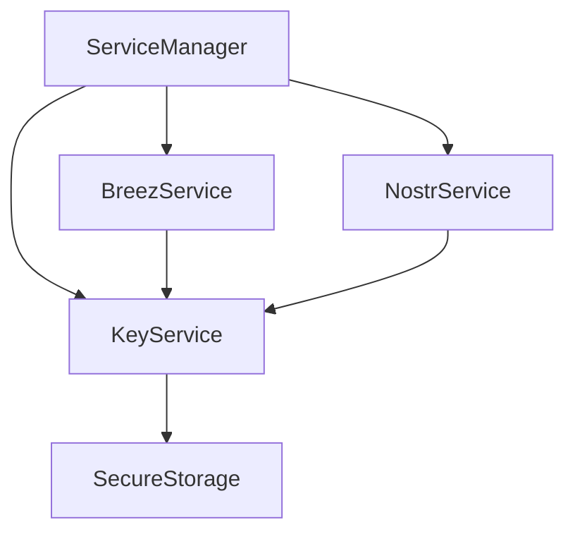

# Key Management in Onyx

## Overview

The key management system in Onyx is designed to be modular and extensible, with a core KeyService that manages BIP39 mnemonics and derived keys. This service acts as the foundation for other services (like BreezService and NostrService) that need cryptographic keys.

## Architecture

### KeyService

The KeyService is a singleton that handles:
1. BIP39 mnemonic generation and storage
2. Key derivation (future expansion)
3. Secure storage of sensitive data
4. Interface for other services to access keys

```typescript
interface KeyServiceConfig {
  // If provided, use this mnemonic instead of generating a new one
  existingMnemonic?: string;
  // Storage options (future expansion)
  storage?: {
    type: 'secure' | 'file';
    path?: string;
  };
}

interface KeyService {
  initialize(config?: KeyServiceConfig): Promise<void>;
  getMnemonic(): Promise<string>;
  isInitialized(): boolean;
  reset(): Promise<void>;
}
```

### Service Dependencies



## Key Derivation

### Breez Keys
- Uses BIP39 mnemonic directly
- Handles its own derivation internally
- Used for Lightning Network operations

### Nostr Keys
- Derives keys by hashing the mnemonic
- Uses SHA256 for private key generation
- Generates bech32-encoded npub/nsec
- Used for Nostr protocol operations

## Initialization Flow

1. ServiceManager starts initialization
2. KeyService is initialized first
   - Generates or loads mnemonic
   - Sets up secure storage
3. Other services initialize in parallel:
   - BreezService gets mnemonic from KeyService
   - NostrService gets mnemonic and derives Nostr keys

## Security Considerations

1. Mnemonic Generation
   - Uses cryptographically secure random number generator
   - Follows BIP39 specification
   - Validates generated mnemonics

2. Storage
   - Sensitive data stored in secure storage when available
   - Fallback to encrypted file storage
   - Keys never stored in plain text

3. Access Control
   - Services must request access through KeyService
   - No direct access to stored keys
   - Audit logging of key access (future)

## Usage Example

```typescript
// Initialize services
await serviceManager.initializeServices()

// Access Nostr keys
const nostrKeys = await nostrService.getKeys()
console.log('Nostr public key:', nostrKeys.npub)

// Access Breez
const balance = await breezService.getBalance()
console.log('Lightning balance:', balance.balanceSat)
```

## Future Enhancements

1. Multi-key Support
   - Generate and manage multiple key pairs
   - Key rotation
   - Different keys for different purposes

2. Enhanced Security
   - Hardware security module support
   - Biometric authentication
   - Key backup and recovery

3. Key Derivation
   - Support for different derivation paths
   - Multiple wallet support
   - Custom derivation schemes

4. Service Integration
   - Support for additional protocols
   - Unified key management interface
   - Cross-protocol operations