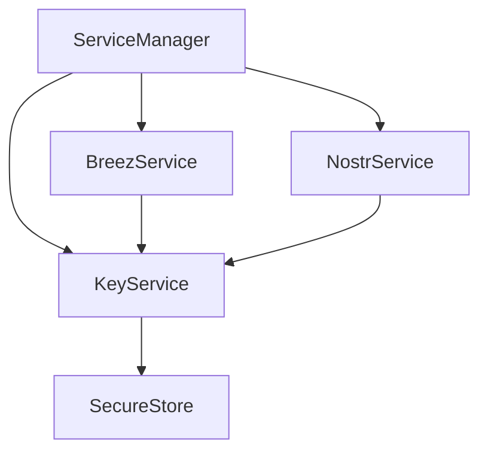

# Key Management in Onyx

## Overview

The key management system in Onyx is designed to be secure and modular, with a core KeyService that manages BIP39 mnemonics and derived keys. This service acts as the foundation for other services (like BreezService and NostrService) that need cryptographic keys.

## Architecture

### Secure Storage

The system uses expo-secure-store for sensitive data:

```typescript
// Secure storage for sensitive data
export const secureStorage = {
  getMnemonic: () => SecureStore.getItemAsync('mnemonic'),
  setMnemonic: (value: string) => SecureStore.setItemAsync('mnemonic', value),
  removeMnemonic: () => SecureStore.deleteItemAsync('mnemonic'),
}
```

### KeyService

The KeyService is a singleton that handles:
1. BIP39 mnemonic generation and secure storage
2. Interface for other services to access keys
3. Validation and security checks

```typescript
interface KeyServiceConfig {
  existingMnemonic?: string
}

interface KeyService {
  initialize(config?: KeyServiceConfig): Promise<void>
  getMnemonic(): Promise<string>
  isInitialized(): boolean
  reset(): Promise<void>
}
```

### Service Dependencies



## Key Derivation

### Breez Keys
- Uses BIP39 mnemonic directly
- Handles its own derivation internally
- Used for Lightning Network operations

### Nostr Keys
- Derives keys by hashing the mnemonic
- Uses SHA256 for private key generation
- Generates bech32-encoded npub/nsec
- Used for Nostr protocol operations

## Initialization Flow

1. ServiceManager starts initialization
2. KeyService is initialized first
   - Loads mnemonic from secure storage if exists
   - Generates new mnemonic if needed
   - Validates and stores mnemonic securely
3. Other services initialize in parallel:
   - BreezService gets mnemonic from KeyService
   - NostrService gets mnemonic and derives Nostr keys

## Security Model

### Native Layer
- All sensitive data stored in expo-secure-store
- Mnemonic never leaves native context
- Services access keys through KeyService

### Web/DOM Layer
- No direct access to secure storage
- Keys passed down from native components
- Temporary access only when needed

### State Management
- Non-sensitive state in zustand with AsyncStorage
- Sensitive data always in SecureStore
- Clear separation of concerns

## Usage Example

```typescript
// Native component with access to secure data
function SecureWrapper({ children }) {
  const { npub } = useNostr() // Accesses secure storage
  
  return (
    <NostrContext.Provider value={{ npub }}>
      {children}
    </NostrContext.Provider>
  )
}

// DOM component receives only what it needs
function WebComponent() {
  const { npub } = useNostrContext() // Gets npub from context
  return <div>Nostr ID: {npub}</div>
}

// Usage
<SecureWrapper>
  <WebComponent />
</SecureWrapper>
```

## Security Considerations

1. Storage Security
   - Sensitive data only in SecureStore
   - Non-sensitive state in AsyncStorage
   - Clear data separation

2. Key Generation
   - Uses cryptographically secure RNG
   - Follows BIP39 specification
   - Validates all mnemonics

3. Access Control
   - Web components never access secure storage directly
   - Keys passed down through React context/props
   - Clear boundaries between secure and non-secure code

## Future Enhancements

1. Enhanced Security
   - Biometric authentication for key access
   - Key encryption at rest
   - Secure enclave integration where available

2. Key Management
   - Multiple key derivation paths
   - Key rotation support
   - Backup and recovery

3. Service Integration
   - Plugin system for new services
   - Key usage policies
   - Access control lists

4. Web Security
   - Memory clearing after use
   - Secure key transmission
   - Audit logging