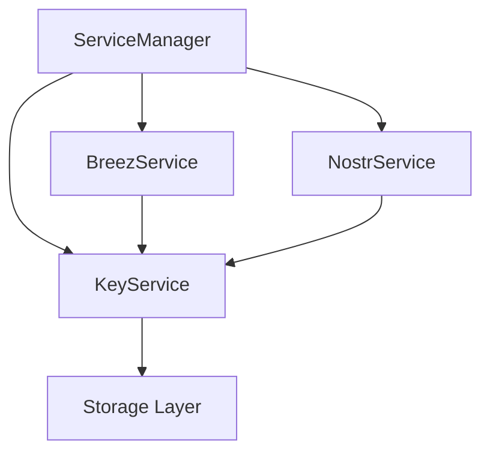

# Key Management in Onyx

## Overview

The key management system in Onyx is designed to be modular and extensible, with a core KeyService that manages BIP39 mnemonics and derived keys. This service acts as the foundation for other services (like BreezService and NostrService) that need cryptographic keys.

## Architecture

### Storage Layer

The system uses a platform-agnostic storage layer that automatically selects the appropriate storage mechanism:

```typescript
interface Storage {
  getItem: (key: string) => Promise<string | null>
  setItem: (key: string, value: string) => Promise<void>
  removeItem: (key: string) => Promise<void>
}

// Web: Uses localStorage
// Native: Uses AsyncStorage
export const storage: Storage = Platform.OS === 'web' 
  ? new WebStorage() 
  : new NativeStorage()
```

### KeyService

The KeyService is a singleton that handles:
1. BIP39 mnemonic generation and storage
2. Cross-platform storage management
3. Interface for other services to access keys

```typescript
interface KeyServiceConfig {
  existingMnemonic?: string
}

interface KeyService {
  initialize(config?: KeyServiceConfig): Promise<void>
  getMnemonic(): Promise<string>
  isInitialized(): boolean
  reset(): Promise<void>
}
```

### Service Dependencies



## Key Derivation

### Breez Keys
- Uses BIP39 mnemonic directly
- Handles its own derivation internally
- Used for Lightning Network operations

### Nostr Keys
- Derives keys by hashing the mnemonic
- Uses SHA256 for private key generation
- Generates bech32-encoded npub/nsec
- Used for Nostr protocol operations

## Initialization Flow

1. ServiceManager starts initialization
2. KeyService is initialized first
   - Loads mnemonic from storage if exists
   - Generates new mnemonic if needed
   - Validates and stores mnemonic
3. Other services initialize in parallel:
   - BreezService gets mnemonic from KeyService
   - NostrService gets mnemonic and derives Nostr keys

## Cross-Platform Considerations

### Web (DOM)
- Uses localStorage for persistence
- Handles browser security constraints
- Works in webview contexts

### Native
- Uses AsyncStorage for persistence
- Handles mobile platform specifics
- Better security options available

## Security Considerations

1. Storage Security
   - Web: localStorage with encryption
   - Native: AsyncStorage with secure storage options
   - No plain text storage of sensitive data

2. Key Generation
   - Uses cryptographically secure RNG
   - Follows BIP39 specification
   - Validates all mnemonics

3. Access Control
   - Services must request access through KeyService
   - No direct access to stored keys
   - Audit logging of key access (future)

## Usage Example

```typescript
// Initialize services
await serviceManager.initializeServices()

// Access Nostr keys
const nostrKeys = await nostrService.getKeys()
console.log('Nostr public key:', nostrKeys.npub)

// Access Breez
const balance = await breezService.getBalance()
console.log('Lightning balance:', balance.balanceSat)
```

## Future Enhancements

1. Enhanced Security
   - Web: Add encryption layer for localStorage
   - Native: Use keychain/keystore
   - Hardware security module support

2. Key Management
   - Multiple key derivation paths
   - Key rotation support
   - Backup and recovery

3. Service Integration
   - Plugin system for new services
   - Key usage policies
   - Access control lists

4. Storage Options
   - IndexedDB for web
   - Secure enclave for native
   - Cloud backup options